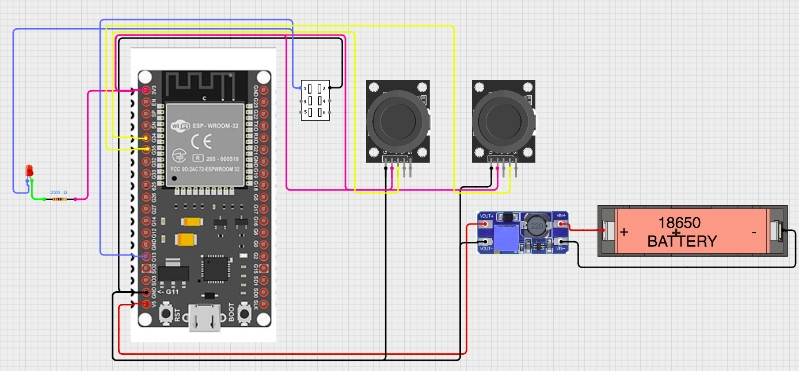

Transmitter (features and notes)

This document describes features in the transmitter sketches (`transmitter_final.ino` and `transmitter_release.ino`).

Core features

- Joystick input with automatic center calibration at startup.
- Deadzone handling to avoid drift when the joystick is centered.
- Axis mapping to pre-mixed left/right motor commands (tank mixing: left = Y+X, right = Y-X).
- Non-linear throttle curve (applied per-axis) to soften low-end throttle and preserve end responsiveness.
- Laser button with edge detection and debounce; LED mirrors current laser state.
- Runtime logging (in `transmitter_final.ino`) for joystick, send, laser, and system information.

Throttle curve & tuning

- The transmitter applies a configurable non-linear curve in `applyJoystickCurve()`.
- To make steering softer around center: increase the `expo` constant (closer to `1.0`) — try `0.8` or `0.9`.
- To make steering more linear/aggressive: decrease `expo` toward `0.0` (try `0.4` or `0.2`).
- Alternative: replace the curve with a power function `sign * pow(abs(norm), exponent)`; exponent>1 softens, exponent<1 makes the center more responsive.

Which sketch to use

- Use `transmitter_final.ino` (beta) while developing or tuning: it includes logging and diagnostic output useful during testing.
- Use `transmitter_release.ino` (prod) for deployments: it keeps the logic lean but includes the same joystick curve and calibration behavior.

Notes

- If you change the curve in the transmitter, be sure to test steering both forward and backward — the per-axis curve (applied before mixing) avoids backward/forward asymmetry.
- Calibration and deadzone values may need to be adjusted for different joystick hardware.

Schematics

Below is a placeholder schematic image for the transmitter. Replace the SVG file in `docs/images/` with the full-resolution schematic PNG/PDF when available.

Circuit diagram link (placeholder): [Transmitter circuit diagram](https://app.cirkitdesigner.com/project/25983b15-9bd0-45e7-839f-15525948b9f8)
